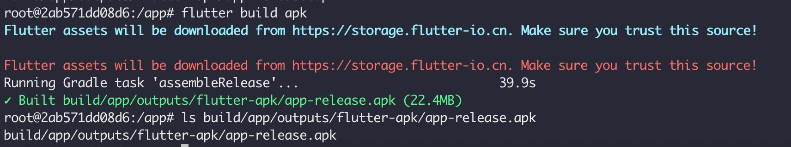
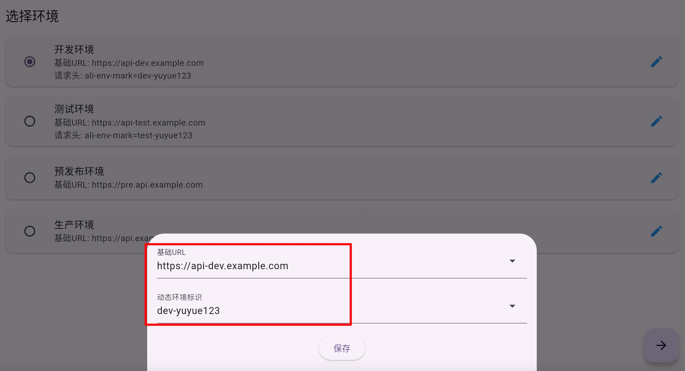

# 客户端打包
```shell
git clone https://github.com/yizhoucp-dev/client_env_mark_demo.git
# 制作打包环境的镜像
docker build -t flutter-apk-builder:v1 .
# 启动容器
docker run flutter-apk-builder:v1
# 进入容器
docker exec -it $(docker ps | grep "flutter-apk-builder:v1" | awk '{print $1}') bash
# 执行打包命令
flutter build apk -v
```


# 安装 apk 包
填写好 URL 和动态环境标识，会在请求的时候自动添加请求头 ali-env-mark: dev-yuyue123，如下图，然后调用相关环境即可

