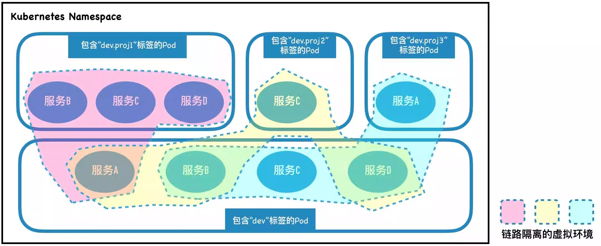
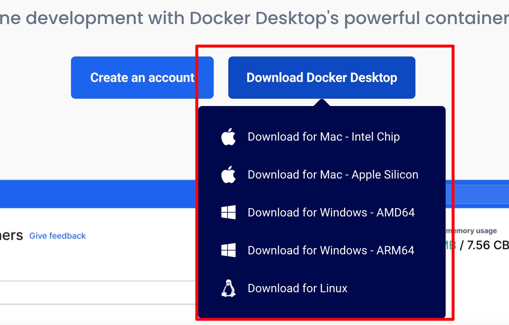
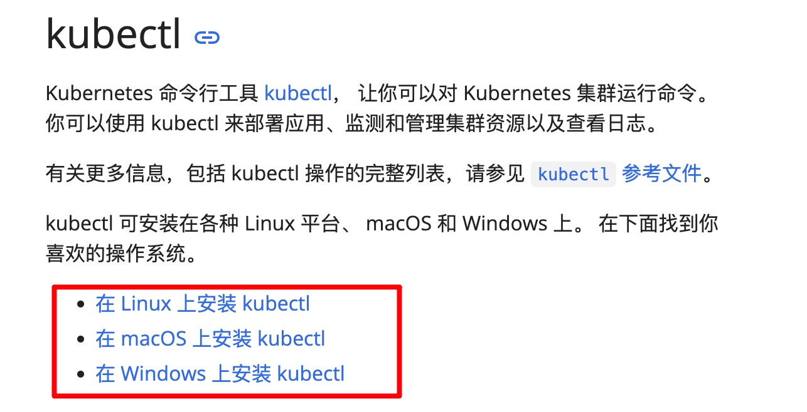
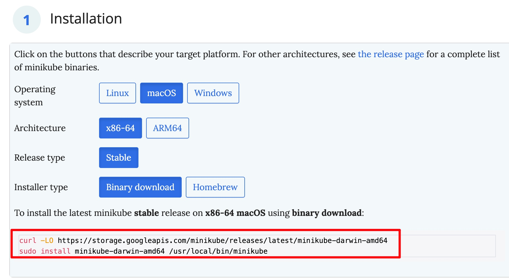
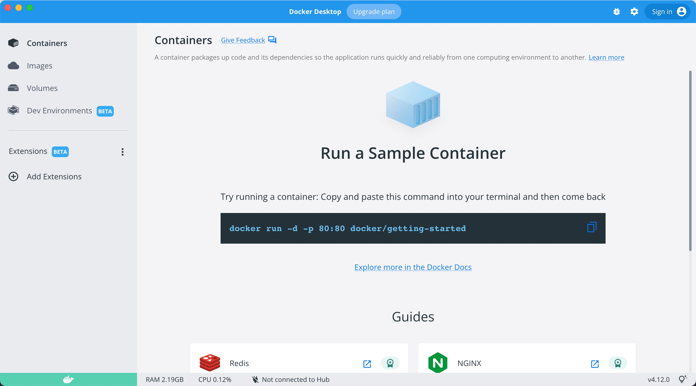
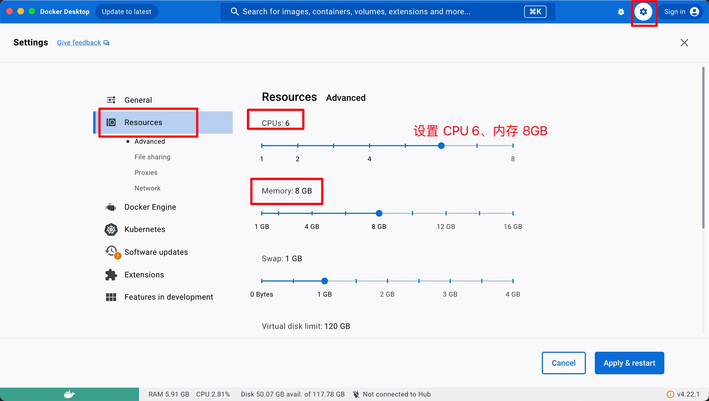
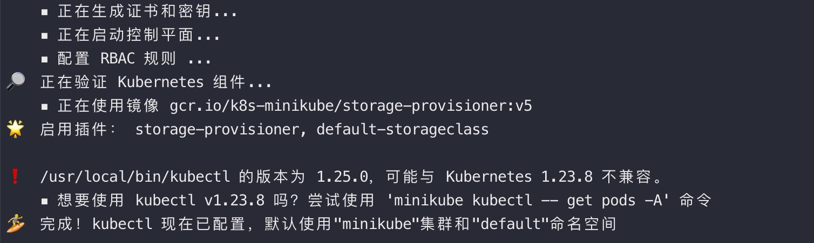
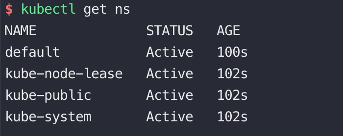
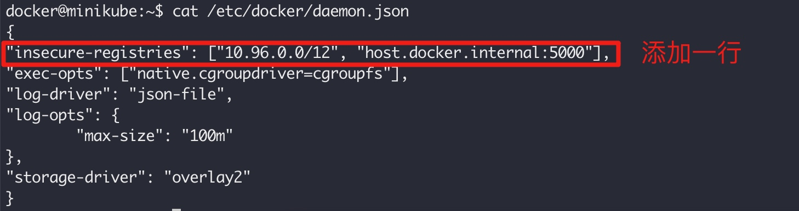

# 动态环境简述
## 说明

动态环境包括**基础环境**和**动态环境**

**基础环境**：包含"dev"标签的pod为基础环境，部署的是一套完整的服务(A~D)。

**动态环境**：假设现在开发一个需求，仅需要B、C、D三个服务，那么就只需要部署B、C、D这三个服务，给pod打上"dev.proj1"标签，服务A则使用基础环境的，这样最终还是有四个服务(粉色虚线框)。该需求上线后，打上"dev.proj1"标签的pod销毁即可，这样就达到了动态创建&动态删除的目的。dev.proj2 和 dev.proj3 同理。

**简单来说，需要哪个服务就部署哪个服务，其他服务复用基础环境的Pod实例，从而达到只需很少资源成本即可创建大量不同微服务版本组合的独立测试环境的目的。**

# 必备工具
使用 minikube 在本地部署动态环境 demo
## 软件
- Docker 桌面版
  - 下载地址：https://www.docker.com/products/docker-desktop/


## 命令行工具
- kubectl
  - 下载地址：https://kubernetes.io/zh-cn/docs/tasks/tools/#kubectl


- helm
  - 下载地址：https://helm.sh/zh/docs/intro/install/
- minikube
  - 下载地址：https://minikube.sigs.k8s.io/docs/start/?arch=%2Fmacos%2Farm64%2Fstable%2Fbinary+download


# 部署基本环境
## 启动 docker 桌面版

### 设置 docker 可用的 CPU、内存 等


## 启动 registry 作为镜像仓
```shell
docker run -d -p 5000:5000 --restart always --name registry registry:2.8
```

## 启动minikube
```shell
# 可指定cpu、内存、k8s版本等
minikube start --cpus=6 --memory=7500m --kubernetes-version=1.23.8
```

使用 kubectl 验证


### 设置镜像仓配置
```shell
minikube ssh  # 进入 Minikube 虚拟机

sudo su - root # 切换为 root 用户
vi /etc/docker/daemon.json
# 添加一行: "insecure-registries": ["10.96.0.0/12", "host.docker.internal:5000"],
```

添加的配置如下


```shell
# 移除 Docker 的 --insecure-registry 启动参数
mkdir -p /etc/systemd/system/docker.service.d
cat > /etc/systemd/system/docker.service.d/override.conf << EOF
[Service]
ExecStart=
ExecStart=/usr/bin/dockerd
EOF
# 重新加载并重启 Docker
systemctl daemon-reload
systemctl restart docker
# 使用 exit 命令退出 Minikube 虚拟机
exit
```

## 部署istio
【注】请按照文档，下载涉及到的代码仓，如下面的 helm-devops 代码仓。其他代码仓同理

helm-devops 代码仓：https://github.com/yizhoucp-dev/helm-devops
```shell
cd helm-devops/values/istio/local

kubectl create namespace istio-system

helm install -n istio-system istio-base -f local-base.yml ../../../charts/istio/base-1.19.9

# 注: arm 与 x86 镜像不同, 根据 CPU 来选择, 查看 local-istiod.yml
helm install -n istio-system istiod -f local-istiod.yml ../../../charts/istio/istiod-1.19.9
```
## 部署ktenv相关组件
ktenv 代码仓：https://github.com/yizhoucp-dev/ktenv

参考文档：https://alibaba.github.io/virtual-environment/#/
```shell
cd ktenv

kubectl apply -f global/ktenv_crd.yaml
kubectl apply -f global/ktenv_webhook.yaml
kubectl -n kt-virtual-environment get all
kubectl get crd virtualenvironments.env.alibaba.com

kubectl create namespace demo

kubectl label namespace demo istio-injection=enabled
NS=demo
kubectl apply -n $NS -f ktenv_operator.yaml
kubectl label namespace $NS environment-tag-injection=enabled
kubectl apply -n $NS -f ktenv_service_account.yaml
# 部署VirtualEnvironment
kubectl apply -n $NS -f VirtualEnvironment.yaml
```

# 部署demo项目
[单项目部署文档](./single_project/README.md)

[多项目部署文档](./multi_project/README.md)
