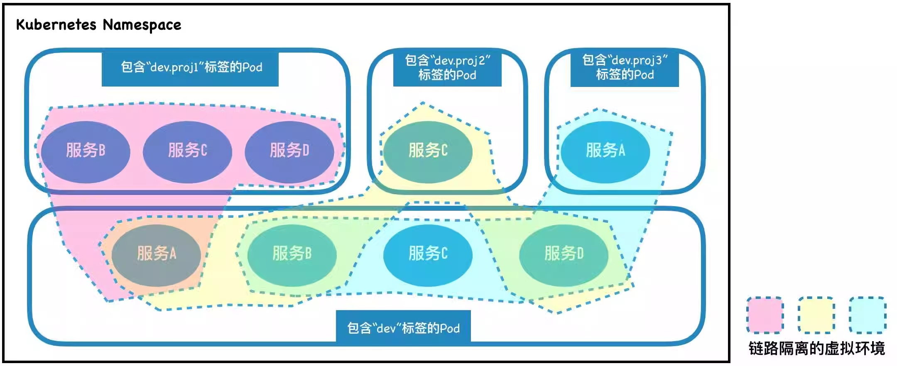
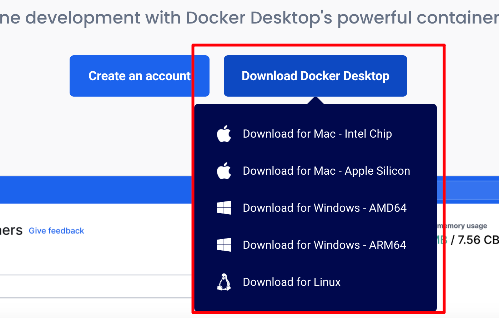
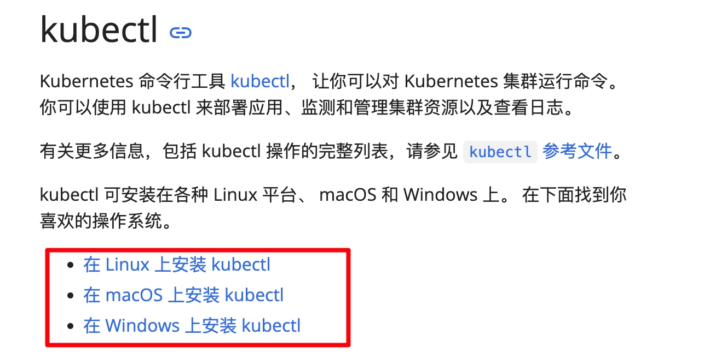
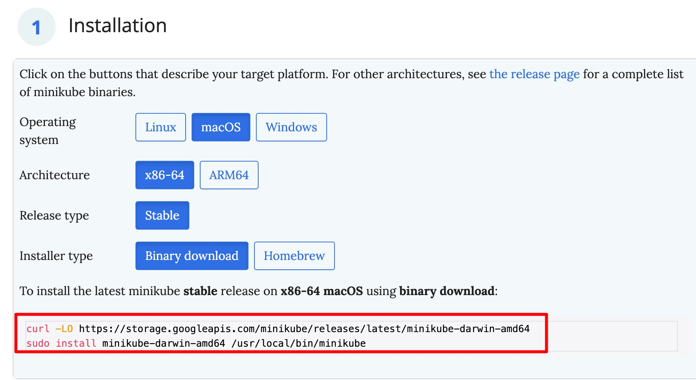
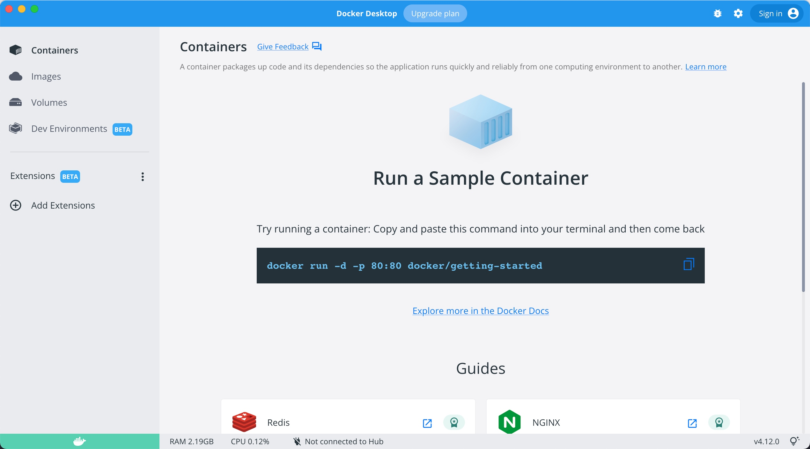
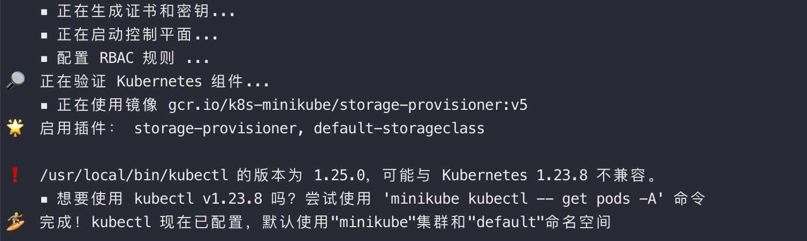
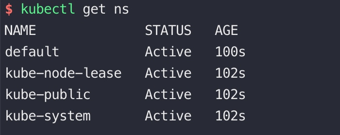

# 动态环境简述
## 说明

动态环境包括**基础环境**和**动态环境**

**基础环境**：包含"dev"标签的pod为基础环境，部署的是一套完整的服务(A~D)。
**动态环境**：假设现在开发一个需求，仅需要B、C、D三个服务，那么就只需要部署B、C、D这三个服务，给pod打上"dev.proj1"标签，服务A则使用基础环境的，这样最终还是有四个服务(粉色虚线框)。该需求上线后，打上"dev.proj1"标签的pod销毁即可，这样就达到了动态创建&动态删除的目的。dev.proj2 和 dev.proj3 同理。

**简单来说，需要哪个服务就部署哪个服务，其他服务复用基础环境的Pod实例，从而达到只需很少资源成本即可创建大量不同微服务版本组合的独立测试环境的目的。**

# 必备工具
使用 minikube 在本地部署动态环境 demo
## 软件
- Docker 桌面版
  - 下载地址：https://www.docker.com/products/docker-desktop/


## 命令行工具
- kubectl
  - 下载地址：https://kubernetes.io/zh-cn/docs/tasks/tools/#kubectl


- helm
  - 下载地址：https://helm.sh/zh/docs/intro/install/
- minikube
  - 下载地址：https://minikube.sigs.k8s.io/docs/start/?arch=%2Fmacos%2Farm64%2Fstable%2Fbinary+download


# 部署基本环境
## 启动 docker 桌面版


## 启动minikube
```shell
# 可指定cpu、内存、k8s版本等
minikube start --cpus=2 --memory=4196m --kubernetes-version=1.23.8
```

使用 kubectl 验证

## 部署istio
helm-devops 代码仓：https://github.com/yizhoucp-dev/helm-devops
```
cd helm-devops/values/istio/local

kubectl create namespace istio-system

helm install -n istio-system istio-base -f local-base.yml ../../../charts/istio/base-1.19.9

helm install -n istio-system istiod -f local-istiod.yml ../../../charts/istio/istiod-1.19.9
```
## 部署ktenv相关组件
ktenv 代码仓：https://github.com/yizhoucp-dev/ktenv

参考文档：https://alibaba.github.io/virtual-environment/#/
```shell
cd ktenv

kubectl apply -f global/ktenv_crd.yaml
kubectl apply -f global/ktenv_webhook.yaml
kubectl -n kt-virtual-environment get all
kubectl get crd virtualenvironments.env.alibaba.com

kubectl create namespace demo

kubectl label namespace demo istio-injection=enabled
NS=demo
kubectl apply -n $NS -f ktenv_operator.yaml
kubectl label namespace $NS environment-tag-injection=enabled
kubectl apply -n $NS -f ktenv_service_account.yaml
部署VirtualEnvironment
kubectl apply -n $NS -f VirtualEnvironment.yaml
```

# 部署demo项目

## python-demo
配置代码仓：https://github.com/yizhoucp-dev/demo-helm-config

python demo 代码仓：https://github.com/yizhoucp-dev/python-env-demo
### 部署说明
在部署的时候注入了环境变量 envMark 

基础环境 envMark：dev

动态环境 envMark：dev-yuyue123

调用 /call_method 接口，会返回 envMark 的值，从而区分环境


```shell
# 部署基础环境
cd demo-helm-config/demo-values/dev && helm install -n demo python-env-demo-dev -f python-env-demo.yaml ../../demo-project-charts

# 部署动态环境(yuyue123)
cd demo-helm-config/demo-values/dev-yuyue123 && helm install -n demo python-env-demo-dev-yuyue123 -f python-env-demo.yaml ../../demo-project-charts
```
查看 pod name

```shell
# 进入 pod 使用命令行测试
kubectl exec -n demo $(kubectl get pod -n demo -l app.kubernetes.io/instance=python-env-demo-dev | grep 'python-env-demo' | awk '{print $1}') -it -- sh 
# 加请求头
curl -H "ali-env-mark: dev-yuyue123" http://python-env-demo-dev.demo/call_method && echo ''
# 不加请求头
curl http://python-env-demo-dev.demo/call_method && echo ''
```
效果如下，在发送请求时携带了请求头，则请求到对应的动态环境，如果没有携带请求头则请求到基础环境

