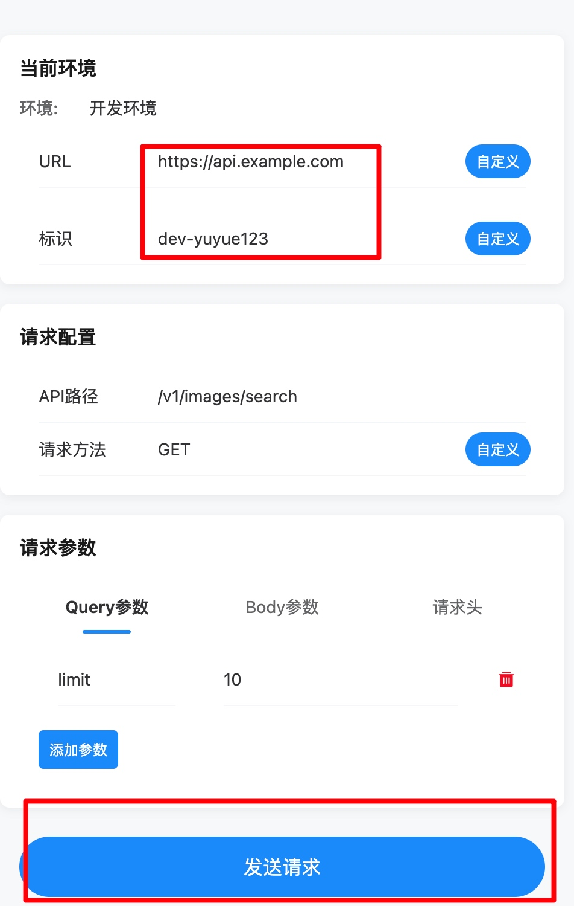

# 前端项目打包
```shell
git clone https://github.com/yizhoucp-dev/frontend_env_mark_demo
# 制作前端项目镜像
docker build -t frontend_env_mark_demo:v1 .
# 启动容器
docker run -d -p 8080:80 frontend_env_mark_demo:v1
```
# 访问前端项目
访问服务器的 8080 端口, 编辑好 Base URL 和环境标识，点击发送请求即可


