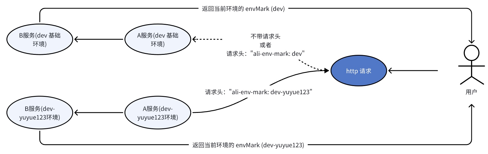
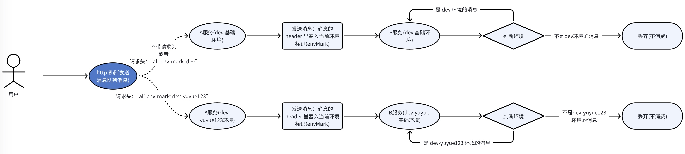

# 部署demo项目(多项目)

## 说明
本文介绍单项目的 Http 调用和多项目的消息队列，如下图所示
### Http 请求示意图



### 消息队列示意图
A服务生产消息，B服务消费消息


## 部署所需的中间件

### 部署 Kafka Server
```shell
kubectl create namespace kafka
cd helm-devops/values/kafka/local
helm install -n kafka kafka -f local.yml ../../../charts/kafka/kafka-v3
```

## Java-demo
配置代码仓：https://github.com/yizhoucp-dev/demo-helm-config

java demo 代码仓：https://github.com/yizhoucp-dev/java-dynamic-env-demo/tree/main/dynamic-env-demo-github