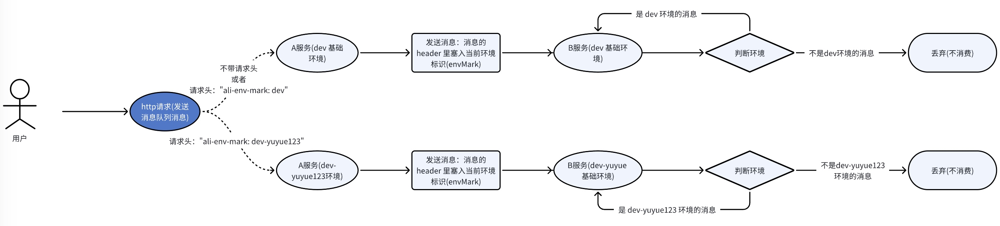

# 部署demo项目(多项目)

## 说明
本文介绍单项目的 Http 调用和多项目的消息队列，如下图所示
### Http 请求示意图


### 消息队列示意图
A服务生产消息，B服务消费消息


## 部署所需的中间件

### 部署 Nacos
```shell
kubectl create namespace nacos
cd helm-devops/values/nacos/local
helm install -n nacos nacos -f local.yml ../../../charts/nacos/nacos-v1
```

### 部署 Redis
```shell
kubectl create namespace redis
cd helm-devops/values/redis/local
helm install -n redis redis -f local.yml ../../../charts/redis/redis-v6.2.6
```


### 部署 Kafka Server
```shell
kubectl create namespace kafka
cd helm-devops/values/kafka/local
helm install -n kafka kafka -f local.yml ../../../charts/kafka/kafka-v3
```


## Java-demo
配置代码仓：https://github.com/yizhoucp-dev/demo-helm-config


java demo 代码仓(Http)：https://github.com/yizhoucp-dev/java-dynamic-env-demo/tree/main/dynamic-env-openfeign

```shell
cd dynamic-env-openfeign
# 制作 dynamic-env-openfeign 镜像
docker build -t 127.0.0.1:5000/mirror/dynamic-env-openfeign:v1 . && docker push 127.0.0.1:5000/mirror/dynamic-env-openfeign:v1
```

java demo 代码仓(Kafka 生产者)：https://github.com/yizhoucp-dev/java-dynamic-env-demo/tree/main/dynamic-env-kafka-demo-producer

```shell
cd dynamic-env-kafka-demo-producer
# 制作 dynamic-env-kafka-demo:producer 镜像
docker build -t 127.0.0.1:5000/mirror/dynamic-env-kafka-demo:producer . && docker push 127.0.0.1:5000/mirror/dynamic-env-kafka-demo:producer
```

java demo 代码仓(Kafka 消费者)：https://github.com/yizhoucp-dev/java-dynamic-env-demo/tree/main/dynamic-env-kafka-demo-consumer

```shell
cd dynamic-env-kafka-demo-consumer
# 制作 dynamic-env-kafka-demo:consumer 镜像
docker build -t 127.0.0.1:5000/mirror/dynamic-env-kafka-demo:consumer . && docker push 127.0.0.1:5000/mirror/dynamic-env-kafka-demo:consumer
```

### Http消息

```shell
# 部署基础环境
cd demo-helm-config/demo-values/dev

helm install -n demo open-feign-test-source -f dynamic-env-openfeign-open-feign-source.yaml ../../demo-project-charts

helm install -n demo open-feign-test -f dynamic-env-openfeign-open-feign-dest.yaml ../../demo-project-charts

# 部署动态环境(yuyue123)
cd demo-helm-config/demo-values/dev-yuyue123

helm install -n demo open-feign-test-source-dev-yuyue123 -f dynamic-env-openfeign-open-feign-source.yaml ../../demo-project-charts

helm install -n demo open-feign-test-dev-yuyue123 -f dynamic-env-openfeign-open-feign-dest.yaml ../../demo-project-charts
```
查看 pod name


#### 基础环境
```shell
# 进入 pod 使用命令行测试
kubectl exec -n demo $(kubectl get pod -n demo -l app.kubernetes.io/instance=open-feign-test-source | grep 'open-feign-test-source' | awk '{print $1}') -it -- sh 
# 增加 dev 请求头，打到基础环境
curl -H "ali-env-mark: dev" open-feign-test-source:80/api/get-remote-header?key=ali-env-mark && echo ''
```

```shell
# 查看发起端 open-feign-test-source 服务日志
kubectl logs -n demo $(kubectl get pod -n demo -l app.kubernetes.io/instance=open-feign-test-source | grep 'open-feign-test-source' | awk '{print $1}') -f
```


```shell
# 查看接受端 open-feign-test 服务日志
kubectl logs -n demo $(kubectl get pod -n demo -l app.kubernetes.io/instance=open-feign-test| grep 'open-feign-test' | awk '{print $1}') -f
```
效果如下，在发送请求时携带了请求头 dev ，则请求到基础环境


#### 动态环境(dev-yuyue123)
```shell
# 增加动态环境的请求头
curl -H "ali-env-mark: dev-yuyue123" open-feign-test-source:80/api/get-remote-header?key=ali-env-mark && echo ''
```

```shell
# 查看发起端 open-feign-test-source-dev-yuyue123 服务日志
kubectl logs -n demo $(kubectl get pod -n demo -l app.kubernetes.io/instance=open-feign-test-source-dev-yuyue123 | grep 'open-feign-test-source' | awk '{print $1}') -f
```


```shell
# 查看接受端 open-feign-test-dev-yuyue123 服务日志
kubectl logs -n demo $(kubectl get pod -n demo -l app.kubernetes.io/instance=open-feign-test-dev-yuyue123 | grep 'open-feign-test' | awk '{print $1}') -f
```
效果如下，在发送请求时携带了请求头 dev-yuyue123 ，则请求到 dev-yuyue123 环境


#### 接收端服务只有基础环境时
##### Http 请求示意图


```shell
# 卸载 dev-yuyue123 接收端
helm uninstall -n demo open-feign-test-dev-yuyue123 
```

```shell
# 增加动态环境的请求头
curl -H "ali-env-mark: dev-yuyue123" open-feign-test-source:80/api/get-remote-header?key=ali-env-mark && echo ''
```

```shell
# 查看发起端 open-feign-test-source-dev-yuyue123 服务日志
kubectl logs -n demo $(kubectl get pod -n demo -l app.kubernetes.io/instance=open-feign-test-source-dev-yuyue123 | grep 'open-feign-test-source' | awk '{print $1}') -f
```


```shell
# 查看接受端 open-feign-test-dev(基础环境) 服务日志
kubectl logs -n demo $(kubectl get pod -n demo -l app.kubernetes.io/instance=open-feign-test | grep 'open-feign-test' | awk '{print $1}') -f
```
效果如下，在发送请求时携带了请求头 dev-yuyue123，但是没有部署对应的环境，请求会打到基础环境，即基础环境作为**兜底**


### MQ 消息(kafka)

```shell
# 部署基础环境
cd demo-helm-config/demo-values/dev

# 生产者服务
helm install -n demo dynamic-env-kafka-demo-producer-dev -f dynamic-env-kafka-demo-producer.yaml ../../demo-project-charts

# 消费者服务
helm install -n demo dynamic-env-kafka-demo-consumer-dev -f dynamic-env-kafka-demo-consumer.yaml ../../demo-project-charts

# 部署动态环境(yuyue123)
cd demo-helm-config/demo-values/dev-yuyue123

helm install -n demo dynamic-env-kafka-demo-producer-dev-yuyue123 -f dynamic-env-kafka-demo-producer.yaml ../../demo-project-charts

helm install -n demo dynamic-env-kafka-demo-consumer-dev-yuyue123 -f dynamic-env-kafka-demo-consumer.yaml ../../demo-project-charts
```
查看 pod name


#### 基础环境
```shell
# 进入 pod 使用命令行测试
kubectl exec -n demo $(kubectl get pod -n demo -l app.kubernetes.io/instance=dynamic-env-kafka-demo-producer-dev | grep 'dynamic-env-kafka-demo-producer-dev' | awk '{print $1}') -it -- sh 
# 不加 ali-env-mark 请求头，打到基础环境
curl -H "Content-Type: application/json" -d '{"data": "text"}' dynamic-env-kafka-demo-producer-dev:80/api/test/send-kafka-msg && echo ''
```


```shell
# 查看生产者 dynamic-env-kafka-demo-producer 服务日志
kubectl logs -n demo $(kubectl get pod -n demo -l app.kubernetes.io/instance=dynamic-env-kafka-demo-producer-dev | grep 'dynamic-env-kafka-demo-producer' | awk '{print $1}') -f
```


```shell
# 查看消费者 dynamic-env-kafka-demo-consumer 服务日志
kubectl logs -n demo $(kubectl get pod -n demo -l app.kubernetes.io/instance=dynamic-env-kafka-demo-consumer-dev| grep 'dynamic-env-kafka-demo-consumer' | awk '{print $1}') -f
```
效果如下，基础环境的消费者消费了这条消息


```shell
# 加 ali-env-mark 请求头，打到 yuyue123 环境
curl -H "ali-env-mark: dev-yuyue123" -H "Content-Type: application/json" -d '{"data": "text-yuyue123"}' dynamic-env-kafka-demo-producer-dev:80/api/test/send-kafka-msg && echo ''
```


```shell
# 查看生产者 dynamic-env-kafka-demo-producer(yuyue123) 服务日志
kubectl logs -n demo $(kubectl get pod -n demo -l app.kubernetes.io/instance=dynamic-env-kafka-demo-producer-dev-yuyue123 | grep 'dynamic-env-kafka-demo-producer' | awk '{print $1}') -f
```


```shell
# 查看消费者 dynamic-env-kafka-demo-consumer(yuyue123) 服务日志
kubectl logs -n demo $(kubectl get pod -n demo -l app.kubernetes.io/instance=dynamic-env-kafka-demo-consumer-dev-yuyue123 | grep 'dynamic-env-kafka-demo-consumer' | awk '{print $1}') -f
```
效果如下，yuyue123 环境的消费者消费了这条消息


```shell
# 查看消费者 dynamic-env-kafka-demo-consumer(基础环境) 服务日志
kubectl logs -n demo $(kubectl get pod -n demo -l app.kubernetes.io/instance=dynamic-env-kafka-demo-consumer-dev| grep 'dynamic-env-kafka-demo-consumer' | awk '{print $1}') -f
```
效果如下，基础环境的消费者不消费该消息


#### 消费者服务只有基础环境时
##### MQ 请求示意图


```shell
# 卸载 dev-yuyue123 消费者服务
helm uninstall -n demo dynamic-env-kafka-demo-consumer-dev-yuyue123
```

```shell
# 加 ali-env-mark 请求头，打到 yuyue123 环境
curl -H "ali-env-mark: dev-yuyue123" -H "Content-Type: application/json" -d '{"data": "text-yuyue123"}' dynamic-env-kafka-demo-producer-dev:80/api/test/send-kafka-msg && echo ''
```

```shell
# 查看生产者 dynamic-env-kafka-demo-producer(yuyue123) 服务日志
kubectl logs -n demo $(kubectl get pod -n demo -l app.kubernetes.io/instance=dynamic-env-kafka-demo-producer-dev-yuyue123 | grep 'dynamic-env-kafka-demo-producer' | awk '{print $1}') -f
```


```shell
# 查看消费者 dynamic-env-kafka-demo-consumer(基础环境) 服务日志
kubectl logs -n demo $(kubectl get pod -n demo -l app.kubernetes.io/instance=dynamic-env-kafka-demo-consumer-dev| grep 'dynamic-env-kafka-demo-consumer' | awk '{print $1}') -f
```
效果如下，在发送请求时携带了请求头 dev-yuyue123，但是没有部署对应的环境，那么基础环境就会消费，即基础环境作为**兜底**消费者


