# 部署demo项目(单项目)

## 说明
本文介绍单项目的 Http 调用和单项目的消息队列(自产自消)，如下图所示
### Http 请求示意图
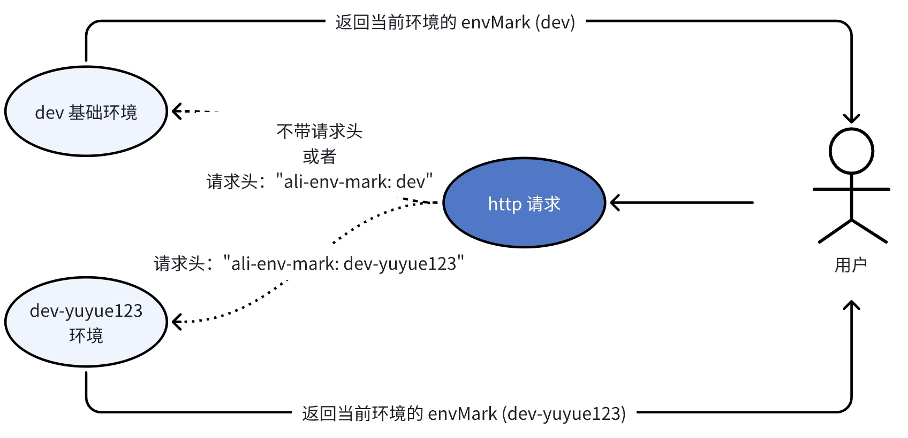


### 消息队列(自产自消)示意图
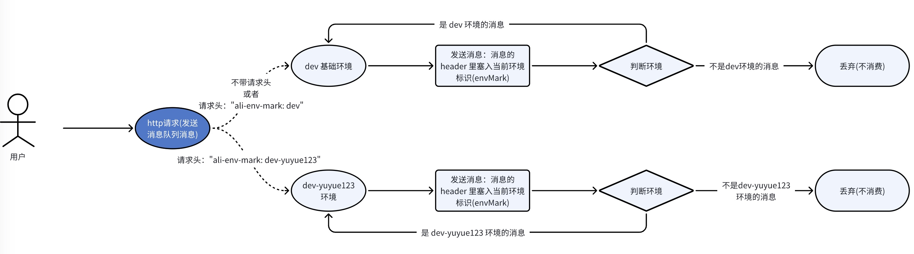


## 部署所需的中间件

### 部署 Kafka Server
```shell
kubectl create namespace kafka
cd helm-devops/values/kafka/local
helm install -n kafka kafka -f local.yml ../../../charts/kafka/kafka-v3
```

## Python-demo
配置代码仓：https://github.com/yizhoucp-dev/demo-helm-config

python demo 代码仓：https://github.com/yizhoucp-dev/python-env-demo
```shell
cd python-env-demo
# 制作 python-env-demo 镜像
docker build -t 127.0.0.1:5000/mirror/python-env-demo:v1 . && docker push 127.0.0.1:5000/mirror/python-env-demo:v1
```

### 部署说明
在部署的时候注入了环境变量 envMark 

基础环境 envMark：dev

动态环境 envMark：dev-yuyue123

调用 /call_method 接口，会返回 envMark 的值，从而区分环境
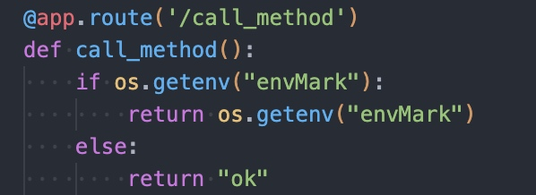

```shell
# 部署基础环境
cd demo-helm-config/demo-values/dev && helm install -n demo python-env-demo-dev -f python-env-demo.yaml ../../demo-project-charts

# 部署动态环境(yuyue123)
cd demo-helm-config/demo-values/dev-yuyue123 && helm install -n demo python-env-demo-dev-yuyue123 -f python-env-demo.yaml ../../demo-project-charts
```
查看 pod name
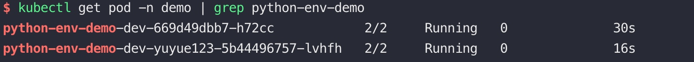
### Http消息
```shell
# 进入 pod 使用命令行测试
kubectl exec -n demo $(kubectl get pod -n demo -l app.kubernetes.io/instance=python-env-demo-dev | grep 'python-env-demo' | awk '{print $1}') -it -- sh 
# 加请求头
curl -H "ali-env-mark: dev-yuyue123" http://python-env-demo-dev.demo/call_method && echo ''
# 不加请求头
curl http://python-env-demo-dev.demo/call_method && echo ''
```
效果如下，在发送请求时携带了请求头，则请求到对应的动态环境，如果没有携带请求头则请求到基础环境
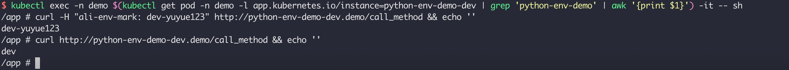

### MQ 消息(kafka)

#### 基础环境自产自消
```shell
# 进入pod
kubectl exec -n demo $(kubectl get pod -n demo -l app.kubernetes.io/instance=python-env-demo-dev | grep 'python-env-demo' | awk '{print $1}') -it -- sh 
# 不加请求头调用接口，会打到基础环境，基础环境自产自消
curl http://python-env-demo-dev.demo/send_kafka_msg && echo ''
```
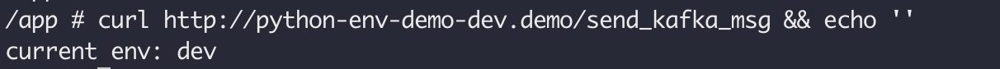

```shell
# 查看基础环境日志
kubectl logs -n demo $(kubectl get pod -n demo -l app.kubernetes.io/instance=python-env-demo-dev | grep 'python' | awk '{print $1}') -f
```
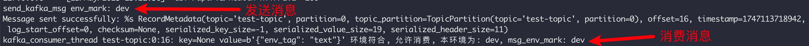

```shell
# 查看yuyue123环境日志
kubectl logs -n demo $(kubectl get pod -n demo -l app.kubernetes.io/instance=python-env-demo-dev-yuyue123 | grep 'python' | awk '{print $1}') -f
```


#### yuyue123环境自产自消
```shell
# 进入pod
kubectl exec -n demo $(kubectl get pod -n demo -l app.kubernetes.io/instance=python-env-demo-dev | grep 'python-env-demo' | awk '{print $1}') -it -- sh 
# 加请求头调用接口，会打到yuyue123环境，yuyue123环境自产自消
curl -H "ali-env-mark: dev-yuyue123" http://python-env-demo-dev.demo/send_kafka_msg && echo ''
```
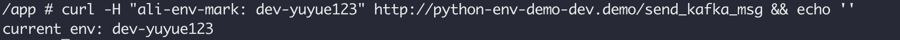

```shell
# 查看基础环境日志
kubectl logs -n demo $(kubectl get pod -n demo -l app.kubernetes.io/instance=python-env-demo-dev | grep 'python' | awk '{print $1}') -f
```


```shell
# 查看yuyue123环境日志
kubectl logs -n demo $(kubectl get pod -n demo -l app.kubernetes.io/instance=python-env-demo-dev-yuyue123 | grep 'python' | awk '{print $1}') -f
```
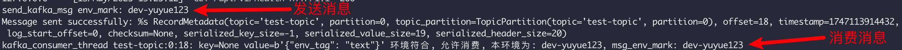

## Java-demo
配置代码仓：https://github.com/yizhoucp-dev/demo-helm-config

java demo 代码仓：https://github.com/yizhoucp-dev/java-dynamic-env-demo/tree/main/dynamic-env-demo

```shell
cd dynamic-env-demo
# 制作 dynamic-env-demo 镜像
docker build -t 127.0.0.1:5000/mirror/dynamic-env-demo:v1 . && docker push 127.0.0.1:5000/mirror/dynamic-env-demo:v1
```

### 部署说明
在部署的时候注入了环境变量 envMark 

基础环境 envMark：dev

动态环境 envMark：dev-yuyue123

调用 /api/cur-env 接口，会返回 envMark 的值，从而区分环境

```shell
# 部署基础环境
cd demo-helm-config/demo-values/dev && helm install -n demo java-env-demo-dev -f java-env-demo.yaml ../../demo-project-charts

# 部署动态环境(yuyue123)
cd demo-helm-config/demo-values/dev-yuyue123 && helm install -n demo java-env-demo-dev-yuyue123 -f java-env-demo.yaml ../../demo-project-charts
```

查看 pod name
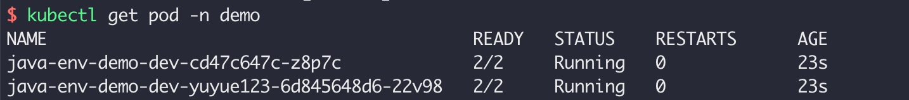

### Http消息
```shell
# 进入 pod 使用命令行测试
kubectl exec -n demo $(kubectl get pod -n demo -l app.kubernetes.io/instance=java-env-demo-dev | grep 'java-env-demo' | awk '{print $1}') -it -- sh 
# 加请求头
curl -H "ali-env-mark: dev-yuyue123" http://java-env-demo-dev.demo/api/cur-env && echo ''
# 不加请求头
curl http://java-env-demo-dev.demo/api/cur-env && echo ''
```
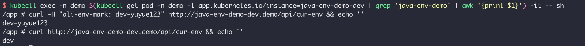

### MQ 消息(kafka)

#### 基础环境自产自消
```shell
# 进入pod
kubectl exec -n demo $(kubectl get pod -n demo -l app.kubernetes.io/instance=java-env-demo-dev | grep 'java-env-demo' | awk '{print $1}') -it -- sh 
# 不加请求头调用生产环境的接口，会打到基础环境，基础环境自产自消
curl http://java-env-demo-dev.demo/api/send-kafka-message?message=text && echo ''
```
```shell
# 查看基础环境日志
kubectl logs -n demo $(kubectl get pod -n demo -l app.kubernetes.io/instance=java-env-demo-dev | grep 'java-env-demo' | awk '{print $1}') -f
```
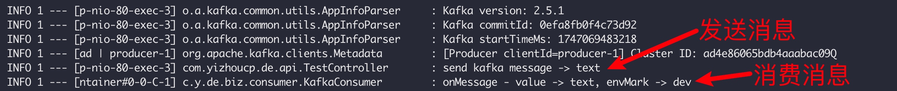

```shell
# 查看yuyue123环境日志
kubectl logs -n demo $(kubectl get pod -n demo -l app.kubernetes.io/instance=java-env-demo-dev-yuyue123 | grep 'java-env-demo' | awk '{print $1}') -f
```
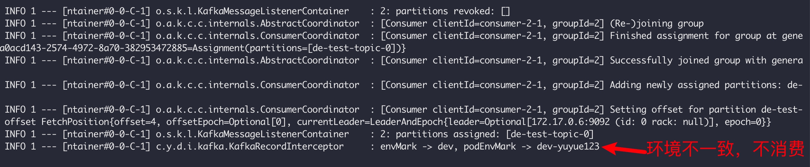

#### yuyue123环境自产自消
```shell
# 进入pod
kubectl exec -n demo $(kubectl get pod -n demo -l app.kubernetes.io/instance=java-env-demo-dev | grep 'java-env-demo' | awk '{print $1}') -it -- sh 
# 加请求头调用生产环境的接口，会打到yuyue123环境，yuyue123环境自产自消
curl -H "ali-env-mark: dev-yuyue123" http://java-env-demo-dev.demo/api/send-kafka-message?message=text && echo ''
```
```shell
# 查看基础环境日志
kubectl logs -n demo $(kubectl get pod -n demo -l app.kubernetes.io/instance=java-env-demo-dev | grep 'java-env-demo' | awk '{print $1}') -f
```
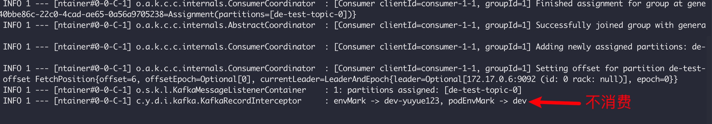

```shell
# 查看yuyue123环境日志
kubectl logs -n demo $(kubectl get pod -n demo -l app.kubernetes.io/instance=java-env-demo-dev-yuyue123 | grep 'java-env-demo' | awk '{print $1}') -f
```
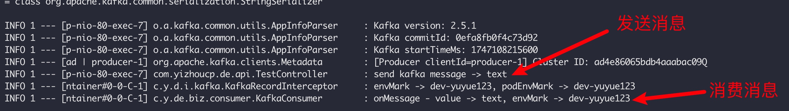
