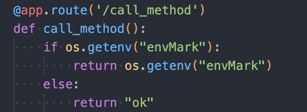
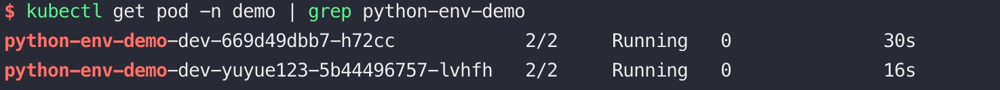
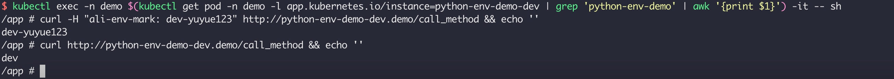

# 部署demo项目(单项目)

## python-demo
配置代码仓：https://github.com/yizhoucp-dev/demo-helm-config

python demo 代码仓：https://github.com/yizhoucp-dev/python-env-demo
### 部署说明
在部署的时候注入了环境变量 envMark 

基础环境 envMark：dev

动态环境 envMark：dev-yuyue123

调用 /call_method 接口，会返回 envMark 的值，从而区分环境


```shell
# 部署基础环境
cd demo-helm-config/demo-values/dev && helm install -n demo python-env-demo-dev -f python-env-demo.yaml ../../demo-project-charts

# 部署动态环境(yuyue123)
cd demo-helm-config/demo-values/dev-yuyue123 && helm install -n demo python-env-demo-dev-yuyue123 -f python-env-demo.yaml ../../demo-project-charts
```
查看 pod name

```shell
# 进入 pod 使用命令行测试
kubectl exec -n demo $(kubectl get pod -n demo -l app.kubernetes.io/instance=python-env-demo-dev | grep 'python-env-demo' | awk '{print $1}') -it -- sh 
# 加请求头
curl -H "ali-env-mark: dev-yuyue123" http://python-env-demo-dev.demo/call_method && echo ''
# 不加请求头
curl http://python-env-demo-dev.demo/call_method && echo ''
```
效果如下，在发送请求时携带了请求头，则请求到对应的动态环境，如果没有携带请求头则请求到基础环境

